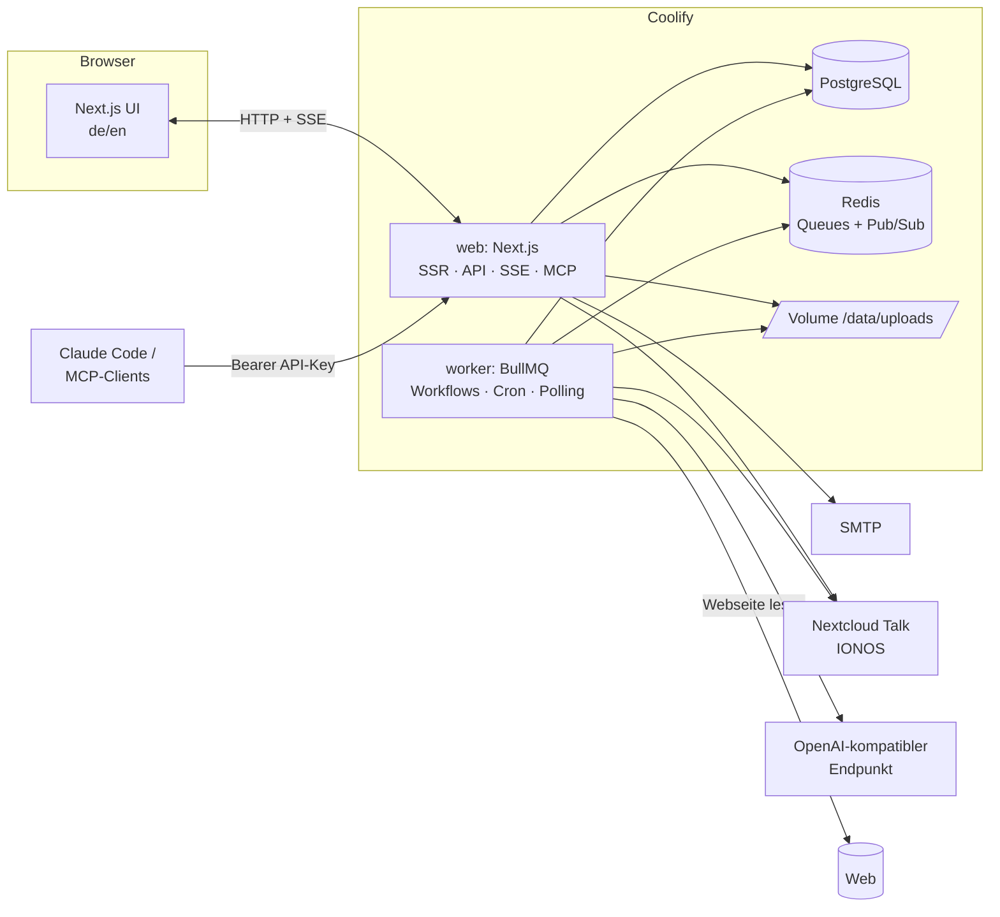

# AI-Up – Architektur- und Umsetzungsplan

Community-Plattform nach dem Vorbild von Circle.so mit Wissensbereichen, Meetings (Video-Calls, selbst gehostet), Messenger, Notifications und einem Workflow-„Maschinenraum" (Trigger/Aktionen, LLM, MCP). Deployment auf Coolify.

> Stand: 19.08.2026 · Status: **Phasen 1–3, 5, 6 + System-Bot umgesetzt** (siehe README.md); **Phase 4 neu geplant** (Abschnitt 5.5: selbst gehosteter Media-Server, Empfehlung LiveKit); Phase 7 offen · Arbeitsname „AI-Up" (Produktname wird vom Admin in der App gesetzt)
>
> Abweichungen vom ursprünglichen Plan: Next.js **16** statt 15 (`proxy.ts` statt Middleware); Nextcloud-Talk-Aufzeichnung auf IONOS nicht möglich → Meetings über eigenen Media-Server; Messenger-Zähler in Primärfarbe statt blauem Punkt.

---

## 1. Ziel und Leitplanken

| Leitplanke | Entscheidung |
|---|---|
| Ein Produkt, ein Repo | Eine Next.js-Codebasis liefert Web-UI, API, Realtime-Endpunkte und MCP-Server. Ein zweiter Prozess (`worker`) aus demselben Image führt Workflows und Zeit-Trigger aus. |
| Selbst gehostet, keine Fremd-SaaS im Kern | PostgreSQL, Redis und Datei-Volume laufen neben der App auf Coolify. Extern nur: SMTP (Mails), Nextcloud (Talk), LLM-Endpunkt (OpenAI-kompatibel). |
| Zweisprachig ab Tag 1 | Alle UI-Texte über `next-intl` (`de`, `en`), Nutzer wählen ihre Sprache im Profil; Standard folgt Browser. |
| Maschinenraum auf Englisch | MCP-Tool-Namen, -Felder, Workflow-Schemas, LLM-Instruktionen: Englisch. UI-Labels dazu übersetzt. |
| Nachvollziehbarkeit | Inhalte sind versioniert, Workflows sind versioniert, jede Ausführung protokolliert Input/Output pro Schritt. Mitglieder können Workflows lesen. |
| Sachliches, modernes Design | Ruhige Oberfläche, linkes Navigations-Panel, Admin-konfigurierbare Farbwelt (Primärfarbe + hell/dunkel), keine Verspieltheit. |

---

## 2. Tech-Stack

| Ebene | Wahl | Begründung |
|---|---|---|
| Framework | **Next.js 15 (App Router), React 19, TypeScript** | Full-Stack in einem Deployment (SSR, Server Actions, Route Handler). Node 24 lokal vorhanden. |
| Datenbank | **PostgreSQL 16 + Drizzle ORM** | Typsichere Schemas, SQL-Migrationen im Repo, JSONB für Workflow-Definitionen. |
| Auth | **Better Auth** mit Magic-Link-Plugin | Magic Link out-of-the-box, Sessions, Admin-Plugin. Freigabestatus (`pending/active/suspended`) als eigenes Feld + Middleware-Gate. |
| Jobs / Scheduler | **BullMQ + Redis 7** | Workflow-Runs, Retries, Cron-Trigger (repeatable jobs), Recording-Polling. |
| Realtime | **Server-Sent Events (SSE)** über Route Handler + **Redis Pub/Sub** | Reicht für Messenger, Notifications, Toasts, Live-Meeting-Punkt. Kein Custom-Server, funktioniert hinter Coolify-Proxy. Client sendet über normale HTTP-Requests. |
| UI | **Tailwind CSS v4 + shadcn/ui + lucide-react** | Theming über CSS-Variablen → Admin-Farbschema ohne Rebuild. |
| i18n | **next-intl** | Routing-los (Cookie/Profil), Server + Client. |
| Markdown | Editor auf CodeMirror-6-Basis mit Vorschau; Rendering `react-markdown` + `remark-gfm` + `rehype-sanitize` | Speicherformat bleibt reines Markdown. |
| Medien | Lokales Volume `/data/uploads`, `sharp` (Thumbnails), `file-type` (MIME-Prüfung), Range-Streaming für Video | Erfüllt „bleibt auf dem Server", Backups über Coolify-Volume. |
| Avatare | `@dicebear/core` (Stil z. B. `thumbs`/`shapes`), serverseitig als SVG erzeugt, Seed = User-ID | Zufälliger, aber stabiler Start-Avatar. |
| E-Mail | `nodemailer` über SMTP (z. B. IONOS-SMTP) + `react-email`-Templates | Magic Link, Freigabe-Info, optional Digest. |
| Nextcloud | OCS-REST-API (Talk/spreed) mit Service-Account + App-Passwort; WebDAV für Aufzeichnungen | Siehe Abschnitt 5.5. |
| Webseite lesen | `@mozilla/readability` + `linkedom` + `turndown` | Nur lesbarer Hauptinhalt, als Markdown. |
| LLM | `openai`-SDK mit `baseURL` (OpenAI-kompatibel) | OpenRouter, Cortecs.ai, einzelne Endpunkte. Structured Outputs über `response_format: json_schema` mit Fallback. |
| MCP | `@modelcontextprotocol/sdk` (Streamable HTTP) unter `/api/mcp` | Claude Code & Co. verbinden sich per URL + Bearer-API-Key. |
| Templates in Workflows | **LiquidJS** | Sichere Variablen-Templates (`{{ trigger.content.url }}`), Filter, kein Code-Ausführungsrisiko. |
| Validierung | zod (API, Server Actions, Workflow-Schemas) | Ein Schema pro Trigger-/Aktionstyp, daraus JSON-Schema für MCP. |
| Tests | Vitest (Unit/Engine), Playwright (E2E-Kernpfade) | |
| Deployment | Docker Compose auf **Coolify** | Services: `web`, `worker`, `postgres`, `redis`. |

---

## 3. Architektur



**Prozesse**

- `web`: Next.js (standalone build). Bedient UI, Server Actions, Route Handler (`/api/*`), SSE (`/api/events`), Datei-Auslieferung (`/api/files/*`), MCP (`/api/mcp`), Health (`/api/health`).
- `worker`: gleicher Docker-Image, anderer Start-Befehl (`node worker.js`). Verarbeitet Queues `workflow-runs`, `scheduler`, `nextcloud-polling`, `media-processing`, `mail`.
- Beide teilen `src/server/*` (Domain-Logik, Repositories, Engine). Nur `web` importiert React.

**Datenfluss Realtime**: Domain-Event (z. B. `message.created`) → in DB schreiben → `redis.publish("user:<id>", event)` → jede `web`-Instanz hält pro verbundenem Client eine SSE-Verbindung und leitet Events aus Redis weiter. Der Client hält einen Event-Store (Zustand) und aktualisiert Badges/Toasts/Listen.

---

## 4. Datenmodell (Kern)

Alle IDs als `uuid`, Zeitstempel `timestamptz`, weiche Löschung wo sinnvoll (`deleted_at`).

**Identität & Einstellungen**
- `users` – `email`, `name`, `role` (`member`|`admin`), `status` (`pending`|`active`|`suspended`), `avatar_media_id`, `locale`, `approved_at`, `approved_by`, `last_seen_at`
- `sessions`, `verifications` – von Better Auth verwaltet
- `app_settings` (Singleton) – `name`, `logo_media_id`, `favicon_media_id`, `theme` (JSON: Primärfarbe, Radius, Modus), `purpose` (Text, Community-Zweck → System-Prompts), `default_locale`, `nextcloud` (JSON, Secrets verschlüsselt), `smtp_from`
- `api_keys` – `user_id`, `name`, `key_hash`, `prefix`, `scopes` (JSON), `last_used_at`, `expires_at`, `revoked_at`

**Wissen**
- `knowledge_areas` – `name`, `slug`, `purpose` (Pflicht), `description`, `icon`, `sort_order`, `visibility`
- `contents` – `area_id`, `type` (`markdown`|`image`|`video`|`link`), `title`, `current_version_id`, `author_id`, `pinned`
- `content_versions` – `content_id`, `version_no`, `body_markdown`, `media_id`, `url`, `meta` (JSON: z. B. Link-Vorschau, Bildmaße), `change_note`, `created_by`
- `media_files` – `storage_path`, `original_name`, `mime`, `size`, `sha256`, `width`, `height`, `duration_s`, `variants` (JSON: Thumbnails), `uploaded_by`
- `comments` (optional Phase 2+) – auf Inhalte

**Meetings**
- `meeting_spaces` – `name`, `slug`, `purpose`, `sort_order`
- `meetings` – `space_id`, `title`, `kind` (`protocol`|`audio`|`video`), `status` (`scheduled`|`live`|`ended`), `starts_at`, `started_at`, `ended_at`, `host_id`, `protocol_markdown`, `nextcloud_room_token`, `nextcloud_join_url`, `recording_status` (`none`|`recording`|`processing`|`available`|`failed`), `recording_media_id`, `transcript_markdown` (später)
- `meeting_participants` – `meeting_id`, `user_id`, `joined_at`, `left_at`

**Messenger & Notifications**
- `contact_requests` – `requester_id`, `addressee_id`, `status` (`pending`|`accepted`|`declined`|`blocked`), `message`
- `conversations` – `kind` (`direct` v1, `group` später)
- `conversation_members` – `conversation_id`, `user_id`, `last_read_at`, `muted`
- `messages` – `conversation_id`, `sender_id`, `body_markdown`, `attachments` (JSON), `edited_at`, `deleted_at`
- `notifications` – `user_id`, `type`, `title`, `body`, `data` (JSON: Deep-Link), `read_at`

**Workflows**
- `workflows` – `name`, `description`, `status` (`draft`|`active`|`paused`), `trigger` (JSON), `steps` (JSON-Array), `version`, `created_by`, `updated_by`
- `workflow_versions` – Snapshot je Änderung (auch per MCP), `changed_by`, `source` (`ui`|`mcp`)
- `workflow_runs` – `workflow_id`, `workflow_version`, `status` (`queued`|`running`|`succeeded`|`failed`|`cancelled`), `trigger_event` (JSON), `context` (JSON), `error`, `started_at`, `finished_at`, `duration_ms`
- `workflow_run_steps` – `run_id`, `index`, `step_id`, `action_type`, `status`, `input`, `output`, `error`, `usage` (JSON: Tokens, Kosten), Zeiten
- `llm_providers` – `name`, `kind` (`openrouter`|`cortecs`|`generic`), `base_url`, `api_key_encrypted`, `available_models` (JSON, gecacht), `enabled_models` (JSON), `capabilities` (JSON), `is_default`
- `questions` – `workflow_id`, `run_id`, `step_id`, `title`, `description`, `fields` (JSON), `audience` (JSON: alle | Rollen | User-IDs), `expires_at`, `closed_at`
- `question_responses` – `question_id`, `user_id`, `answers` (JSON) — pro Nutzer maximal eine Antwort
- `question_dismissals` – wer eine Frage weggeklickt hat
- `audit_log` – Admin-relevante Aktionen (Freigabe, Settings, API-Key, Workflow-Änderung)

Secrets (`api_key_encrypted`, Nextcloud-App-Passwort) werden mit AES-256-GCM und `APP_ENCRYPTION_KEY` aus der Umgebung verschlüsselt.

---

## 5. Funktionsdesign (Community-Seite)

### 5.1 Registrierung, Freigabe, Login

1. **Registrieren**: E-Mail + Name (+ optional Nachricht an Admins). Anlage mit `status=pending`. Zufälliger Avatar wird erzeugt und gespeichert. Admins erhalten Notification (+ optional Mail).
2. **Freigabe**: Admin-Bereich „Mitglieder → Wartend" mit Freigeben/Ablehnen. Bei Freigabe: `status=active`, Mail „Dein Zugang ist freigeschaltet" mit Magic Link.
3. **Login**: Nur Magic Link. Formular E-Mail → Better Auth sendet Link (Gültigkeit 15 Min, Einmalnutzung). Für `pending` wird kein Link verschickt, sondern der Hinweis „Konto wartet auf Freigabe" (ohne zu verraten, ob die Adresse existiert – neutrale Formulierung).
4. **Middleware**: Alle Routen außer `/login`, `/register`, `/auth/*`, `/api/health`, `/api/mcp` benötigen aktive Session mit `status=active`. Admin-Routen `/admin/*` zusätzlich `role=admin`.
5. Erster Admin: per `SEED_ADMIN_EMAIL` beim ersten Start automatisch `active`+`admin`.

### 5.2 Profil & Avatare

- Profilseite: Name, Kurzbeschreibung, Sprache, Foto-Upload (Zuschneiden im Browser, quadratisch, max. 5 MB, Ausgabe WebP 512 px + 96 px).
- Ohne Upload wird der generierte SVG-Avatar genutzt; „Zufälligen Avatar neu würfeln" als Button.

### 5.3 Wissensbereiche & Inhalte

- Admin legt Wissensbereiche an (Name, **Zweck – Pflichtfeld**, Beschreibung, Icon, Reihenfolge). Der Zweck fließt zusammen mit dem Community-Zweck in LLM-System-Prompts ein und wird Mitgliedern angezeigt.
- Linkes Panel: Abschnitt „Wissen" listet Bereiche; „Mitglieder"; Abschnitt „Meetings" listet Meeting-Bereiche; unten „Workflows" (Lesezugriff).
- Bereichsseite: Feed/Liste der Inhalte (Kacheln mit Typ-Icon, Vorschau, Autor, Datum), Filter nach Typ, Suche (Postgres-Volltext, `tsvector` auf Titel + Markdown).
- **Inhaltstypen**:
  - `markdown` – Titel + Markdown-Body (Editor mit Vorschau, Bild-Einbettung per Upload).
  - `image` – Upload (JPEG/PNG/WebP/GIF, max. 20 MB) **oder** externe URL; Beschreibung/Alt-Text.
  - `video` – Upload (MP4/WebM, max. z. B. 500 MB, konfigurierbar) **oder** Link (YouTube/Vimeo/direkte URL → Embed bzw. `<video>`).
  - `link` – URL + optional Notiz; Server holt Titel/Description/OG-Bild als Vorschau.
- **Versionierung**: Jede Speicherung erzeugt eine neue `content_versions`-Zeile. Mediendateien werden nie überschrieben; jede Version zeigt auf ihre Datei. UI: „Verlauf"-Tab mit Diff für Markdown, Vorschau alter Bild-/Videoversionen, „Diese Version wiederherstellen" (erzeugt neue Version).
- Bearbeiten dürfen: Autor, Admins (später Moderatoren-Rolle).
- Domain-Events: `content.created`, `content.updated`, `content.deleted` (mit `type` als Filter) → Workflow-Trigger.

### 5.4 Mitglieder

- Übersicht aller aktiven Mitglieder (Kacheln: Avatar, Name, Kurzbeschreibung, „online"-Punkt via `last_seen_at` < 3 Min).
- Klick → Profil mit Buttons „Kontaktanfrage senden" / „Nachricht schreiben" (wenn bestätigt).

### 5.5 Meeting-Bereiche & Video-Calls (Phase 4, neu geplant)

**Ausgangslage (Stand 19.08.2026):** Die ursprünglich geplante Aufzeichnung über Nextcloud Talk ist auf der IONOS-Managed-Nextcloud nicht möglich (kein Recording-Backend, siehe Abschnitt 12). Ziel jetzt: **selbst gehostete Video-Calls für bis zu 30 Teilnehmende** mit serverseitigem **Audio-Mitschnitt**, eingebettet in die App.

#### Recherche-Ergebnis: Jitsi vs. LiveKit

| Kriterium | Jitsi Meet (JVB) | LiveKit |
|---|---|---|
| 30 Teilnehmende, Video | Ja. Ein Videobridge-Server reicht; Jitsi-Benchmarks zeigen ~20 % CPU bei 1000+ Streams, der Engpass ist Bandbreite (720p ≈ 2,5 Mbit/s pro Stream). Empfehlung laut Handbuch: ≥ 4 dedizierte Kerne, 8 GB RAM, 1 Gbit/s. | Ja, sehr effizient (SFU, ein Go-Binary). Kapazität skaliert mit abonnierten Tracks; 1-Gbit-Port begrenzt auf grob 200–400 Teilnehmende, weit vor der CPU. |
| Komponenten | web (nginx) + prosody + jicofo + jvb (+ jibri für Recording) – 4–5 Container, Prosody nutzt nur 1 Kern | livekit-server + redis (+ egress für Recording) – 2–3 Container |
| **Audio-only-Aufzeichnung** | Nur über **Jibri** (Headless-Chrome + ffmpeg): 4 Kerne / 8 GB **pro gleichzeitiger Aufzeichnung**, *eine* Aufzeichnung je Jibri-Instanz, kein Audio-only-Modus (Video aufnehmen, danach Tonspur extrahieren). | **Egress** mit `audio_only=true` liefert direkt eine gemischte Audiodatei (OGG/MP4) ins Dateisystem/S3; ressourcenintensiv (≈ 4 CPU/4 GB), aber nur während der Aufzeichnung aktiv. |
| Einbettung in die App | IFrame-API (`external_api.js`) + JWT-Auth – fertige, vollständige Oberfläche (Kacheln, Screen-Share, Chat, Handheben, Breakout-Räume). | `@livekit/components-react` (fertige `VideoConference`-Komponente: Kacheln, Screen-Share, Chat) – UI läuft **in unserer App**, eigenes de/en, eigenes Design; keine Breakout-Räume out of the box. |
| Ereignisse für Live-Punkt/Teilnehmer | Keine nativen Webhooks (nur IFrame-Events im Client oder Prosody-Module). | **Webhooks** (`room_started`, `participant_joined/left`, `room_finished`, `egress_ended`) → saubere Server-seitige Zustände. |
| Lasttest | jitsi-meet-torture (aufwendig) | `lk load-test` im CLI enthalten (z. B. 30 Publisher/Subscriber simulieren) |
| Netzwerk | 80/443 (Websockets `/xmpp-websocket`, `/colibri-ws` über Traefik), **10000/udp direkt** am Host | 7880 (WS, über Traefik), 7881/tcp + **UDP-Range (z. B. 50000–50200) direkt** am Host, optional eingebauter TURN auf 443/3478 |
| Betrieb auf Coolify | Kein offizielles Template; Community berichtet Probleme (Port-Exposure, Compose-Validierung). Machbar als eigene Compose-Ressource, aber fummelig. | Eigene Compose-Ressource mit 2–3 Services; keine bekannten Coolify-Sonderfälle außer UDP-Port-Mapping. |

**Antwort auf die Kernfrage:** Ja – der Media-Server (Jitsi-Videobridge *oder* LiveKit) gehört in jedem Fall in einen **separaten Service** (eigene Compose-Ressource in Coolify, bei Bedarf auf einem eigenen Server): Er braucht direkt am Host geöffnete UDP-Ports (nicht über Traefik), soll CPU-/Netzlast von der Next.js-App fernhalten und unabhängig skaliert werden können. Für **30 Teilnehmende in einem Call** reicht ein einzelner Media-Server; mehrere Bridges/Nodes werden erst bei vielen parallelen großen Calls nötig.

**Größenordnung:** 30 × 720p ≈ 30 × 2,5 Mbit/s ≈ 75–100 Mbit/s Upload vom Server (mit Simulcast/Last-N deutlich weniger) – ein VPS mit 1 Gbit/s genügt. Empfehlung: Media-Server 4 vCPU / 8 GB; solange aufgezeichnet wird zusätzlich ≈ 4 vCPU / 4–8 GB für Jibri bzw. Egress. Praktisch: **App-VPS (bestehend) + Media-VPS 8 vCPU / 16 GB** oder ein großer Host mit zwei Coolify-Ressourcen.

**Empfehlung: LiveKit.** Ausschlaggebend sind die native Audio-only-Aufzeichnung, die Webhooks (Live-Punkt, Teilnehmerstand, „Aufzeichnung fertig“ ohne Polling), der geringere Ressourcenbedarf und die Einbettung als Teil unserer UI. Jitsi bleibt eine gute Wahl, wenn die fertige Jitsi-Oberfläche (Breakout-Räume, Lobby-Features) wichtiger ist als Audio-Mitschnitt und Integration – dann mit Jibri (Video-Aufzeichnung, Tonspur im Worker extrahieren) und deutlich mehr Betriebsaufwand. Der Code kapselt den Anbieter weiterhin in einem `MeetingProvider`-Interface.

#### Zielbild (mit LiveKit)

1. **Meeting-Bereiche** (Admin: Name, Zweck) enthalten **Meetings** der Arten `protocol` (nur Markdown-Protokoll), `audio`, `video`.
2. **Starten/Beitreten:** Jedes aktive Mitglied kann ein Meeting starten oder beitreten. Die App erzeugt serverseitig ein LiveKit-Access-Token (API-Key/-Secret, Raum = Meeting-ID, Identität = Nutzer-ID, Name/Avatar als Metadaten, Host = `roomAdmin`). Der Call läuft **in der App** (`/meetings/[space]/[meeting]/call`) mit `@livekit/components-react`; Audio-Meetings ohne Kamera-Kacheln.
3. **Live-Status:** LiveKit-Webhook → `/api/livekit/webhook` (signiert) → `meetings.status = live|ended`, `meeting_participants` (joined/left) → Realtime-Event `meeting.started/ended/participants` → **grün blinkender Punkt** im linken Menü am Meeting-Bereich und am Meeting, Teilnehmerzahl live. Fallback: Raum per LiveKit-API abfragen (`listRooms`) beim Laden.
4. **Aufzeichnung (nur Audio):** Beim Start (oder vom Host per Knopf) startet die App eine Room-Composite-Egress mit `audio_only=true` in eine Datei auf dem gemeinsamen Volume (`/data/recordings`), optional S3. `egress_ended`-Webhook → Worker verschiebt die Datei nach `media_files` (purpose `recording`), setzt `recording_status=available`, emittiert `meeting.recording.available` → Workflows (später Transkription + Zusammenfassung per LLM).
5. **Meeting-Seite:** Status/Teilnehmende, Protokoll-Editor (Markdown, versioniert wie Inhalte), Audio-Player für die Aufzeichnung, Verlauf.
6. **Konfiguration** (Admin → Integrationen): LiveKit-URL (wss), API-Key/-Secret (verschlüsselt), Egress-Zielpfad, „Verbindung testen“ (Rooms auflisten). Aufzeichnung pro Meeting-Bereich standardmäßig an/aus.
7. **Workflows:** Trigger `meeting.started`, `meeting.ended`, `meeting.recording.available`; Aktion `create_meeting` (später).

#### Umsetzungsschritte Phase 4

| Schritt | Inhalt |
|---|---|
| 4a Infrastruktur-Spike *(Vorlage + lokale Verifikation fertig, 22.08.2026: `deploy/livekit/`, `docs/meetings-livekit.md`; Audio-only-Egress lokal bestätigt)* | LiveKit + Redis + Egress als Compose-Ressource auf Coolify (eigene Subdomain `meet.<domain>`, Traefik für WS, UDP-Range + 7881/tcp am Host, TURN), `lk load-test` mit 30 Publishern/Subscribern, Audio-only-Egress in Volume testen. Ergebnis: bestätigte Server-Größe, `docs/adr/0001-meeting-provider.md`. |
| 4b Datenmodell & Admin *(fertig 22.08.2026)* | `meeting_spaces`, `meetings`, `meeting_protocol_versions`, `meeting_participants`, `integrations` (verschlüsselte Secrets), Admin-CRUD für Bereiche, Admin → Integrationen (LiveKit-URL/Key/Secret, Verbindungstest), Sidebar aus DB mit Live-Punkt. |
| 4c Protokoll-Meetings *(fertig 22.08.2026)* | Meeting anlegen/bearbeiten/löschen (Art, Termin, Mitschnitt-Schalter), Markdown-Protokoll mit Versionen/Diff/Wiederherstellen, Bereichs-/Detailseiten (Live/Geplant/Vergangen). Audio-/Video-Art nur wählbar, wenn LiveKit aktiviert ist. |
| 4d Calls | Token-Endpunkt, Call-Seite mit LiveKit-Komponenten (de/en, Audio-/Video-Modus, Screen-Share), Start/Beitreten, Webhook-Endpunkt, Live-Punkt + Teilnehmer live, „Meeting beenden“ (Raum schließen). |
| 4e Aufzeichnung | Egress-Start/Stop, Abholung per Worker, Player, Aufbewahrungsfrist, Event + Workflow-Trigger; Admin-Schalter je Bereich. |
| 4f Abschluss | E2E mit zwei Browsern, Lasttest-Protokoll, Doku (Betrieb, Ports, Backup der Aufzeichnungen). |

### 5.6 Messenger

- **Kontaktanfrage**: Profil → „Kontaktanfrage" (optional mit kurzer Nachricht). Empfänger erhält Notification „Anfrage von X" mit Annehmen/Ablehnen. Erst nach `accepted` wird eine `direct`-Konversation angelegt; Blockieren jederzeit möglich.
- **Chat**: Konversationsliste links (Avatar, letzter Nachrichtenauszug, ungelesen-Zähler), Thread rechts, Markdown-Light (fett, kursiv, Links, Code), Bild-Anhänge (Upload), Tippen-Indikator (SSE-Event, gedrosselt), Gelesen-Status über `last_read_at`.
- **Blauer Punkt** am Nachrichten-Icon in der Top-/Seitenleiste, sobald `unread_count > 0` (Server liefert Zähler beim Laden, SSE aktualisiert live). Punkt verschwindet, wenn Konversation geöffnet und ans Ende gescrollt wird.
- Realtime-Events: `message.created`, `message.read`, `conversation.typing`, `contact.request.created`, `contact.request.accepted`.

### 5.7 Notifications

- Glocken-Icon mit Zähler; Panel mit Liste (Anfragen, Workflow-Ergebnisse, Freigabe, Meeting-Start, Erwähnungen später). Jede Notification hat Deep-Link und optionale Aktionen (Annehmen/Ablehnen).
- Quellen: System (Freigabe, Kontaktanfrage), Meetings (`meeting.started` im abonnierten Bereich), Workflow-Aktion `notify_user`.
- Optionale E-Mail-Benachrichtigung je Typ (Profil-Einstellung), Zustellung über `mail`-Queue.

### 5.8 Design, i18n, Theming

- Layout: linkes Panel (Logo/Name, Navigation, unten Profil), Top-Bar (Suche, Nachrichten-Icon mit blauem Punkt, Glocke, Sprachumschalter), Content-Bereich; rechts oben Toast-Stack (Workflows), links unten Frage-Karten (Umfragen/CTA).
- Farbschema: Admin wählt Primärfarbe (+ automatisch abgeleitete Töne über OKLCH), Radius, Standard-Modus (hell/dunkel/system). Ausgabe als CSS-Variablen in `<html style>`; Logo/Favicon über `/api/branding/logo` und `/favicon.ico` → aus `media_files`.
- Alle Strings in `messages/de.json` und `messages/en.json`; Datums-/Zahlenformat über `Intl`. E-Mails ebenfalls zweisprachig (nach Nutzer-Locale).

---

## 6. Maschinenraum

### 6.1 Admin-Bereich

Navigation `/admin`:
- **Allgemein**: Name, Logo, Favicon, Farbschema, Standardsprache.
- **Zweck**: Freitext „Wozu dient diese Community?" (Pflicht) + Ton/Sprache für LLM-Antworten. Wird als Baustein in jeden LLM-System-Prompt eingefügt (`{{ app.purpose }}`), ebenso der Zweck des jeweiligen Wissensbereichs.
- **Mitglieder**: Wartend / Aktiv / Gesperrt, Rolle setzen, Freigeben, Sperren.
- **Wissensbereiche** und **Meeting-Bereiche**: CRUD, Sortierung.
- **Workflows**: Liste (Status, letzter Lauf, Erfolgsquote), Editor, Historie, Statistik.
- **LLM**: Provider/Endpunkte, Modelle freischalten, Testaufruf.
- **Integrationen**: Nextcloud, SMTP-Test.
- **API-Schlüssel**: eigene Keys für MCP anlegen/widerrufen (Klartext nur einmal sichtbar).
- **Audit-Log**.

### 6.2 Workflow-Engine

**Definition (JSON, versioniert)**

```json
{
  "id": "wf_…",
  "name": "Summarize saved links",
  "status": "active",
  "trigger": {
    "type": "content.created",
    "config": { "contentTypes": ["link"], "areaIds": [] }
  },
  "steps": [
    { "id": "read", "action": "read_webpage",
      "config": { "url": "{{ trigger.content.url }}" } },
    { "id": "summary", "action": "llm",
      "config": {
        "providerId": "…", "model": "anthropic/claude-sonnet-4.5",
        "systemPrompt": "You are the assistant of the community \"{{ app.name }}\". Purpose: {{ app.purpose }}",
        "prompt": "Summarize in German in 5 bullet points:\n\n{{ steps.read.output.markdown }}",
        "temperature": 0.3,
        "outputSchema": { "type": "object", "properties": { "summary": {"type":"string"}, "tags": {"type":"array","items":{"type":"string"}} }, "required": ["summary"] }
      } },
    { "id": "notify", "action": "notify_user",
      "config": { "userIds": ["{{ trigger.content.authorId }}"],
                  "title": "Summary ready: {{ trigger.content.title }}",
                  "body": "{{ steps.summary.output.summary }}",
                  "link": "/knowledge/{{ trigger.content.areaId }}/{{ trigger.content.id }}" } }
  ]
}
```

- v1: lineare Schrittfolge; jeder Schritt optional mit `condition` (Liquid-Ausdruck, z. B. `{{ steps.read.output.wordCount > 200 }}`) und `onError: stop|continue`.
- Kontext für Templates: `trigger`, `steps.<id>.output`, `app` (Name, Zweck, URL), `now`, `run`.
- Später: Verzweigungen, Schleifen über Listen, Sub-Workflows.

**Registry (Code)**: `src/server/workflows/triggers/*` und `.../actions/*` – jede Definition exportiert `type`, `configSchema` (zod), `outputSchema`, `labels` (de/en), `describeForMcp()` und `run(ctx, config)`. Aus der Registry entstehen automatisch UI-Formulare (Schema-getrieben), MCP-Tool-Beschreibungen und Validierung.

**Trigger v1**
| Typ | Config | Payload |
|---|---|---|
| `content.created` / `content.updated` | `contentTypes[]`, `areaIds[]` | `content` (id, type, title, url, body, areaId, authorId, versionNo) |
| `schedule` | `cron` (z. B. `0 9 * * 1-5`), `every` (`30m`), `timezone` | `scheduledFor` |
| `question.answered` | `questionId` (dynamisch, siehe 6.5) | `question`, `response`, `user`, `stats` |
| `meeting.recording.available` | `spaceIds[]` | `meeting`, `mediaId` |
| `manual` | – | `input` (Admin/MCP-Startparameter) |

**Aktionen v1**
| Typ | Zweck |
|---|---|
| `llm` | Aufruf des konfigurierten OpenAI-kompatiblen Endpunkts (6.3) |
| `read_webpage` | URL → lesbarer Text/Markdown, Titel, Autor, Wortzahl (6.4) |
| `ask_user` | Mini-Formular unten links, erzeugt Trigger `question.answered` (6.5) |
| `notify_user` | Notification an Nutzer/Rollen/alle, optional E-Mail |
| `create_content` | Ergebnis als neuen Inhalt (z. B. Markdown-Zusammenfassung) in Wissensbereich schreiben |
| `http_request` (Admin-only) | Generischer Webhook/POST – nützlich für spätere Anbindungen |

**Ausführung**
1. Domain-Event entsteht → `web` schreibt Event und legt für jeden passenden aktiven Workflow einen `workflow_runs`-Datensatz (`queued`) an und stellt Job in `workflow-runs`-Queue.
2. `worker` nimmt Job, setzt `running`, publiziert `workflow.run.started` (an alle Nutzer, damit der Toast erscheint – bei Nutzer-bezogenen Runs nur an den Auslöser + Admins; Admin-Setting).
3. Schritte sequenziell; pro Schritt `workflow_run_steps` mit Input (gerendert), Output, Dauer, Usage. Timeouts pro Aktion (LLM 120 s, Web 30 s), Retries mit Backoff für transiente Fehler.
4. Ende → `succeeded|failed`, Event `workflow.run.finished`. Fehler landen als Admin-Notification.
5. Concurrency: max. N parallele Runs (Env), pro Workflow optional `maxConcurrent`. Cron-Trigger dedupliziert über `jobId`.

**Toast (oben rechts)**: Bei `run.started` erscheint eine Karte „⚙︎ Summarize saved links läuft…", bei `finished` wechselt sie zu ✓/✗ mit Dauer. Mindestanzeige 2 s, danach Auto-Hide nach weiteren 3 s (bei Fehler bleibt sie bis zum Wegklicken). Mehrere Karten stapeln sich; Klick öffnet Run-Details (Admins) bzw. Workflow-Beschreibung (Mitglieder).

**Historie & Statistik**: `/admin/workflows/<id>/runs` mit Filter (Status, Zeitraum), Run-Detail als Schritt-Zeitleiste mit Input/Output (JSON-Viewer, Prompt/Antwort lesbar), Retry-Button. Statistik: Läufe pro Tag (Balken), Erfolgsquote, Ø/95%-Dauer, Tokens/Kosten je Modell, Top-Fehler. Mitglieder sehen `/workflows`: Name, Beschreibung, Trigger, Schritte in Klarsprache, „zuletzt gelaufen".

### 6.3 LLM-Aktion & Provider-Konfiguration

- **Provider anlegen**: Name, Art (`openrouter` | `cortecs` | `generic`), Base-URL (`https://openrouter.ai/api/v1`, `https://api.cortecs.ai/v1`, oder eigener), API-Key (verschlüsselt), optionale Zusatz-Header. „Modelle laden" → `GET /models`; bei OpenRouter werden `supported_parameters`, Kontextgröße und Preise mitgespeichert (Capabilities). Bei `generic` ohne `/models`: Modell-IDs manuell eintragen.
- Admin markiert **freigeschaltete Modelle**; nur diese sind in Workflows/MCP wählbar. Ein Standardmodell.
- **Aktion `llm` – Config-Felder** (Englisch, MCP-sichtbar): `providerId`, `model`, `systemPrompt`, `prompt`, `messages[]` (optional statt prompt), `temperature`, `topP`, `maxTokens`, `reasoningEffort` (`none|low|medium|high`; nur wenn Modell es unterstützt – bei OpenRouter `reasoning: {effort}`, bei OpenAI-kompatibel `reasoning_effort`), `outputSchema` (JSON Schema → `response_format: {type:"json_schema"}`; wenn nicht unterstützt: Schema in Prompt einbetten + JSON-Extraktion + zod-Validierung + ein Retry), `stopSequences`, `seed`.
- **Output**: `{ text, json?, model, usage: {promptTokens, completionTokens, cost?}, finishReason }`.
- Die verfügbaren Optionen werden je Provider/Modell aus `capabilities` abgeleitet; MCP-Tool `describe_action("llm", providerId, model)` liefert das gültige Schema. Testaufruf im Admin („Prompt ausprobieren").

### 6.4 Aktion „Webseite lesen"

- `fetch` mit Timeout, max. 5 MB, User-Agent, Redirect-Limit; **SSRF-Schutz** (nur http/https, keine privaten/Link-Local-IPs, DNS-Auflösung prüfen).
- HTML → `linkedom` → `@mozilla/readability` → Hauptartikel → `turndown` → Markdown. Zusätzlich: `title`, `byline`, `excerpt`, `siteName`, `lang`, `wordCount`, `publishedAt` (falls Meta), kanonische URL.
- PDFs (Phase 2): Text-Extraktion. Ergebnis wird 24 h gecacht (Redis, Key = URL-Hash).

### 6.5 Aktion „Dem Nutzer Frage stellen" + dynamischer Trigger

- Config: `title`, `description`, `fields[]` (Typen: `single_choice`, `multi_choice`, `text`, `rating`, `yes_no`, `cta` mit Button-Label + Link), `audience` (`all` | `roles` | `userIds` | `{{ trigger.user.id }}`), `expiresIn`, `allowDismiss`.
- Beim Ausführen wird ein `questions`-Datensatz erzeugt und per SSE `question.created` an die Zielgruppe gesendet → **Mini-Formular unten links** (aufklappbar, mehrere Fragen als Stapel, „Später"). Antwort → `question_responses` (eine pro Nutzer, änderbar bis `closed_at`).
- **Dynamischer Trigger**: Jede `ask_user`-Konfiguration erhält eine stabile `questionKey`; im Trigger-Katalog erscheint automatisch `question.answered` mit Auswahl der bekannten Fragen (Label = Titel). Payload: Antwort, Nutzer, aggregierte Zwischenergebnisse (Anzahl, Verteilung). Beispiel-Workflow: „Umfrage beantwortet → `notify_user` Danke + Ergebnis-Link".
- Ergebnisse: Admin-Seite je Frage mit Verteilung; Frage kann geschlossen werden.

### 6.6 Zeit-Trigger

- UI: Auswahl „Jeden Wochentag um 09:00", „Alle 30 Minuten", „Wöchentlich …" oder freier Cron-Ausdruck; Zeitzone (Standard: App-Zeitzone, z. B. `Europe/Berlin`).
- Umsetzung: BullMQ Repeatable Job pro aktivem Workflow (`jobId = wf:<id>:v<version>`); bei Änderung/Pause wird der Repeat-Job ersetzt/entfernt. Beim Worker-Start Abgleich DB ↔ Redis. Verpasste Läufe während Downtime werden nicht nachgeholt (Anzeige „nächster Lauf" in UI).

### 6.7 MCP-Server & API-Schlüssel

- Endpoint: `POST /api/mcp` (Streamable HTTP, stateless), Auth `Authorization: Bearer aiup_<prefix>_<secret>`. Keys nur für Admins, gehasht (SHA-256) gespeichert, Scopes v1: `workflows:read`, `workflows:write`, `runs:read`, `runs:trigger`, `llm:read`.
- Rate-Limit pro Key; jede Nutzung im Audit-Log; `last_used_at`.
- **Tools (Englisch)**:
  - `list_workflows`, `get_workflow(id)`, `create_workflow(definition)`, `update_workflow(id, patch|definition, changeNote)`, `set_workflow_status(id, active|paused)`, `delete_workflow(id)`
  - `validate_workflow(definition)` – Trockenlauf der Schema-Validierung inkl. Template-Variablen
  - `list_triggers()`, `list_actions()`, `describe_action(type, providerId?, model?)` – liefert JSON-Schema + Doku
  - `list_llm_providers()`, `list_llm_models(providerId)`
  - `list_runs(workflowId?, status?, since?)`, `get_run(runId)` (mit Schritten), `trigger_workflow(id, input)`
  - `get_workflow_stats(workflowId, range)`
  - `list_questions()`, `get_question_results(id)`
- **Resources**: `aiup://workflows/{id}` (JSON), `aiup://docs/workflow-schema` (Markdown-Doku für LLM-Clients).
- Beispiel-Setup in Claude Code wird in der Admin-UI angezeigt (`claude mcp add --transport http aiup https://<domain>/api/mcp --header "Authorization: Bearer …"`).

---

## 7. Realtime-Events (SSE)

Kanal je Nutzer (`user:<id>`) + globaler Kanal (`broadcast`). Ereignistypen:

`notification.created`, `notification.read`, `message.created`, `message.read`, `conversation.typing`, `contact.request.*`, `meeting.started`, `meeting.ended`, `meeting.recording.available`, `workflow.run.started`, `workflow.run.finished`, `question.created`, `question.closed`, `presence.changed`, `settings.updated` (Theme live nachladen).

Client: ein `EventSource` pro Tab, automatische Reconnects mit `Last-Event-ID`; beim Reconnect werden Zähler serverseitig neu geladen. Heartbeat alle 25 s (Proxy-Timeouts).

---

## 8. Sicherheit

- Magic-Link-Tokens einmalig, 15 Min gültig, Rate-Limit pro E-Mail/IP; Session-Cookie `HttpOnly, Secure, SameSite=Lax`.
- Autorisierung zentral (`can(user, action, resource)`), auf Server Actions und Route Handlern.
- Uploads: MIME per Magic Bytes, Größenlimits, Dateinamen randomisiert, Auslieferung nur über authentifizierte Route (`/api/files/<id>`), Bilder werden neu kodiert (entfernt EXIF/Skripte in SVG – SVG-Uploads nur für Logo/Favicon durch Admins, mit Sanitizer).
- Markdown-Rendering mit `rehype-sanitize`; keine Roh-HTML-Einbettung durch Nutzer.
- SSRF-Schutz in `read_webpage`/Link-Vorschau/Video-Links.
- Secrets verschlüsselt (AES-256-GCM), nie in Logs; API-Keys gehasht.
- CSRF durch Server-Actions-Origin-Check + SameSite; CSP-Header (Frame-Ancestors, Script-Src self).
- Audit-Log für Admin-Aktionen; Workflow-Änderungen per MCP sind Snapshots.
- DSGVO: Datenexport/Konto-Löschung (Anonymisieren statt Hard-Delete für Nachrichten), Aufbewahrungsfrist für Aufzeichnungen konfigurierbar.

---

## 9. Deployment auf Coolify

**docker-compose.yml (Skizze)**

```yaml
services:
  web:
    build: .
    command: ["node", "server.js"]        # Next.js standalone
    environment: [DATABASE_URL, REDIS_URL, APP_URL, APP_ENCRYPTION_KEY, BETTER_AUTH_SECRET, SMTP_*, UPLOAD_DIR=/data/uploads, SEED_ADMIN_EMAIL]
    volumes: ["uploads:/data/uploads"]
    depends_on: [postgres, redis]
    healthcheck: { test: ["CMD", "wget", "-qO-", "http://localhost:3000/api/health"] }
  worker:
    build: .
    command: ["node", "worker.js"]
    environment: [same as web]
    volumes: ["uploads:/data/uploads"]
    depends_on: [postgres, redis]
  postgres:
    image: postgres:16-alpine
    volumes: ["pgdata:/var/lib/postgresql/data"]
  redis:
    image: redis:7-alpine
    command: ["redis-server", "--appendonly", "yes"]
    volumes: ["redisdata:/data"]
volumes: { uploads: {}, pgdata: {}, redisdata: {} }
```

- Coolify: „Docker Compose"-Ressource aus dem Git-Repo, Domain + Let's-Encrypt auf `web:3000`, Env-Variablen im Coolify-UI (Secrets), Volumes persistent. Migrationen laufen beim Start von `web` (`drizzle-kit migrate` im Entrypoint, idempotent) – Worker wartet auf Health von `web`.
- Multi-Stage-Dockerfile (deps → build → runner, `output: "standalone"`, `sharp` für linux/amd64). Image ~250 MB.
- Backups: Coolify-Backup für Postgres (täglich) + Volume-Backup `uploads` (rsync/restic auf S3-kompatiblen Speicher, z. B. IONOS Object Storage). Restore-Doku im Repo.
- Logs strukturiert (pino, JSON) → Coolify-Logs; `/api/health` prüft DB + Redis + Volume-Schreibbarkeit.
- Größere Uploads: Coolify/Traefik `client_max_body_size` bzw. Traefik-Buffering-Middleware auf 512 MB setzen; Uploads chunked (tus-ähnlich, eigenes einfaches Chunk-Protokoll) ab Phase 2.

**Umgebungsvariablen (Auswahl)**: `APP_URL`, `DATABASE_URL`, `REDIS_URL`, `BETTER_AUTH_SECRET`, `APP_ENCRYPTION_KEY`, `SMTP_HOST/PORT/USER/PASS/FROM`, `UPLOAD_DIR`, `MAX_UPLOAD_MB`, `SEED_ADMIN_EMAIL`, `DEFAULT_LOCALE`, `APP_TIMEZONE`, `WORKFLOW_CONCURRENCY`. Nextcloud- und LLM-Zugangsdaten werden **in der App** (verschlüsselt) gepflegt, nicht als Env – der Admin soll sie ohne Redeploy ändern können.

---

## 10. Projektstruktur

```
ai-up/
├─ src/
│  ├─ app/                      # Next.js App Router
│  │  ├─ (auth)/login, register, auth/verify
│  │  ├─ (app)/                 # eingeloggter Bereich mit Shell (Panel, Topbar)
│  │  │  ├─ knowledge/[area]/[content]
│  │  │  ├─ members/[user]
│  │  │  ├─ meetings/[space]/[meeting]
│  │  │  ├─ messages/[conversation]
│  │  │  ├─ notifications
│  │  │  ├─ workflows            # Lesezugriff Mitglieder
│  │  │  └─ profile
│  │  ├─ admin/…                # Maschinenraum
│  │  └─ api/ (auth, events (SSE), files, upload, mcp, health, branding)
│  ├─ components/               # UI (shadcn), Editor, Toasts, QuestionDock, LiveDot …
│  ├─ i18n/ + messages/de.json, en.json
│  ├─ server/
│  │  ├─ db/ (schema.ts, migrations/, client)
│  │  ├─ auth/ (better-auth config, guards)
│  │  ├─ domain/ (knowledge, meetings, messenger, notifications, members, settings)
│  │  ├─ events/ (event bus → DB + Redis publish)
│  │  ├─ realtime/ (SSE hub)
│  │  ├─ media/ (storage, image pipeline, streaming)
│  │  ├─ integrations/ (nextcloud/, llm/, mail/, webreader/)
│  │  ├─ workflows/ (engine, registry, triggers/, actions/, templates, scheduler)
│  │  └─ mcp/ (server, tools, auth)
│  └─ lib/ (zod-Schemas, utils, crypto)
├─ worker/index.ts              # BullMQ-Worker-Entry
├─ tests/ (unit, e2e)
├─ docker/ (Dockerfile, entrypoint.sh), docker-compose.yml
├─ drizzle.config.ts, next.config.ts, tailwind.config.ts
└─ docs/ (ADRs, MCP-Doku, Betrieb/Restore)
```

---

## 11. Umsetzungsphasen

| Phase | Inhalt | Ergebnis / Abnahme |
|---|---|---|
| **0 – Setup & Spikes** | Repo, Tooling, Docker-Compose lokal, Coolify-Testdeploy „Hello". **Spike Nextcloud**: Raum anlegen, Capabilities/Recording prüfen, Testaufzeichnung. **Spike LLM**: OpenRouter/Cortecs `/models` + Structured Output. | Go/No-Go für Talk-Recording; Provider-Capabilities verstanden. |
| **1 – Fundament** | Auth (Magic Link, Freigabe, Middleware), Datenbank-Basis, App-Shell (Panel/Topbar), i18n, Admin: Allgemein/Branding/Zweck/Mitglieder, Profil + Avatare, Mitgliederübersicht, Mail-Versand, Health/Logs, Deploy-Pipeline. | Nutzer registriert sich, wird freigegeben, loggt sich per Link ein, App ist gebrandet und zweisprachig. |
| **2 – Wissen** | Wissensbereiche (Admin), Inhalte aller vier Typen, Upload-Pipeline (Bilder/Videos, Thumbnails, Streaming), Link-Vorschau, Versionierung + Verlauf, Suche. | Inhalte anlegen/bearbeiten mit Historie; Medien liegen persistent im Volume. |
| **3 – Realtime, Messenger, Notifications** | SSE-Hub + Redis, Notifications-Center, Kontaktanfragen, 1:1-Chat, Ungelesen-Punkt, Präsenz. | Zwei Nutzer chatten live; Anfrage-Flow und Badges funktionieren. |
| **4 – Meetings** (neu geplant, siehe 5.5) | Meeting-Bereiche, Protokoll-Meetings, **LiveKit** als separater Coolify-Service (Spike + Lasttest 30 Teilnehmende), Calls in der App, Webhooks → Live-Punkt/Teilnehmer, Audio-only-Egress → Aufzeichnung am Meeting, Workflow-Trigger. | Meeting starten/beitreten mit bis zu 30 Personen, blinkender Punkt, Audio-Aufzeichnung erscheint am Meeting. |
| **5 – Workflow-Engine** | Registry, Engine, Worker, Trigger `content.*`/`schedule`/`manual`, Aktionen `llm`/`read_webpage`/`notify_user`/`create_content`, LLM-Provider-Admin, Workflow-Editor (schema-getriebene Formulare), Toasts, Historie, Statistik, Mitglieder-Ansicht. | Beispiel „Link speichern → Webseite lesen → LLM-Zusammenfassung → Notification" läuft Ende-zu-Ende. |
| **6 – Fragen & MCP** | Aktion `ask_user` + Fragen-Dock unten links + dynamischer Trigger `question.answered`, Ergebnisse; MCP-Server, API-Keys, Tool-Set, Doku, Test mit Claude Code. | Admin editiert per Claude Code eine LLM-Aktion; Umfrage-Workflow mit Folge-Notification funktioniert. |
| **7 – Härtung & Betrieb** | Tests (Engine, Auth, Upload), Sicherheits-Review, Backups/Restore-Probe, Performance (Indizes, Caching), Barrierefreiheit-Grundlagen, Doku, Onboarding-Texte. | Produktivfreigabe. |

Reihenfolge ist so gewählt, dass nach Phase 2 bereits eine nutzbare Wissensplattform steht und Phase 4 (das größte externe Risiko) parallel zu 3/5 begonnen werden kann.

---

## 12. Risiken & offene Punkte

1. ~~Nextcloud-Talk-Aufzeichnung~~ – Spike (18.08.2026): HPB vorhanden, **Recording-Backend nicht konfiguriert**, IONOS-Verwaltung bietet keine Option → Phase 4 auf selbst gehosteten Media-Server (LiveKit, Alternative Jitsi) umgeplant, siehe 5.5. Neues Risiko: UDP-Port-Exposure/Validierung von Compose-Ressourcen in Coolify → im Spike 4a zuerst klären; Fallback: Media-Server auf eigenem VPS außerhalb von Coolify.
2. **Große Video-Uploads** hinter Coolify/Traefik: Body-Limits, Timeouts. → Chunk-Upload, Limits konfigurierbar.
3. **LLM-Provider-Unterschiede** (Structured Output, Reasoning-Parameter). → Capability-Erkennung + Fallback-Parser; pro Provider kleine Adapter.
4. **Toasts für alle Nutzer** bei vielen Workflow-Läufen könnten stören. → Admin-Setting: „Toasts an alle | nur Betroffene + Admins", Zusammenfassen bei > 3 gleichzeitigen Läufen.
5. **E-Mail-Zustellbarkeit** (Magic Link). → SPF/DKIM für Absender-Domain, IONOS-SMTP mit Auth, Rate-Limits.
6. **Rollen** über member/admin hinaus (Moderator, Bereichs-Verantwortliche) sind noch nicht spezifiziert – das Datenmodell lässt es zu (`role`, später `area_permissions`).

**Annahmen (bitte bestätigen oder korrigieren)**
- Wissens- und Meeting-Bereiche sind für alle aktiven Mitglieder sichtbar (keine privaten Bereiche in v1).
- Inhalte dürfen von allen Mitgliedern angelegt werden; Bearbeiten nur Autor/Admin.
- Messenger v1 nur 1:1; Gruppenchats später.
- Meetings können von jedem Mitglied gestartet werden (nicht nur Admins).
- Mitglieder treten Talk-Calls als Gäste bei (keine Nextcloud-Konten je Mitglied).
- Zeitzone der App: Europe/Berlin.
- SMTP-Zugang (z. B. IONOS) und Nextcloud-Service-Account werden vom Betreiber bereitgestellt.

---

## 13. Nächste Schritte

1. Annahmen aus Abschnitt 12 bestätigen; Nextcloud-Zugang (URL, Service-Nutzer, App-Passwort) und SMTP-Daten für Spike bereitstellen.
2. Phase 0 starten: Repo-Grundgerüst (Next.js, Drizzle, Better Auth, next-intl, shadcn, BullMQ), Docker-Compose lokal, Coolify-Test-Deploy.
3. Nextcloud- und LLM-Spikes durchführen und Ergebnis als ADR in `docs/` festhalten (`docs/adr/0001-meeting-provider.md`).
4. Danach Phase 1 nach obigem Plan.
